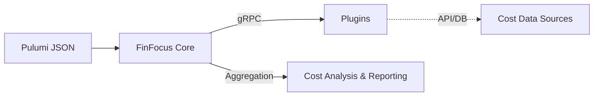

# FinFocus

[](https://github.com/rshade/finfocus/actions/workflows/ci.yml)
[](https://github.com/rshade/finfocus/actions/workflows/ci.yml)
[](https://goreportcard.com/report/github.com/rshade/finfocus)
[](LICENSE)

**Cloud cost analysis for Pulumi infrastructure** - Calculate projected and actual infrastructure costs without modifying your Pulumi programs.

FinFocus Core is a CLI tool that analyzes Pulumi infrastructure definitions to provide accurate cost estimates and historical cost tracking through a flexible plugin-based architecture.

## Key Features

- **📊 Projected Costs**: Estimate monthly costs before deploying infrastructure
- **💰 Actual Costs**: Track historical spending with detailed breakdowns
- **🔌 Plugin-Based**: Extensible architecture supporting multiple cost data sources
- **🧪 E2E Testing**: Comprehensive guide for validating infrastructure costs against real cloud resources
- **🌱 Sustainability**: Estimate carbon footprint and energy usage
- **📈 Advanced Analytics**: Resource grouping, filtering, and aggregation
- **💰 Budgets**: Core engine support for filtering and health aggregation of budgets
- **📱 Multiple Formats**: Table, JSON, and NDJSON output options
- **🔍 Smart Filtering**: Filter by resource type, tags, or custom expressions
- **⏰ Time Range Queries**: Flexible date range support for cost analysis
- **🏗️ No Code Changes**: Works with existing Pulumi projects via JSON output

## Quick Start

### 1. Installation

Download the latest release or build from source:

```bash
# Download latest release (coming soon)
curl -L https://github.com/rshade/finfocus/releases/latest/download/finfocus-linux-amd64 -o finfocus
chmod +x finfocus

# Or build from source
git clone https://github.com/rshade/finfocus
cd finfocus
make build
./bin/finfocus --help
```

### 2. Generate Pulumi Plan

Export your infrastructure plan to JSON:

```bash
cd your-pulumi-project
pulumi preview --json > plan.json
```

### 3. Calculate Costs

**Projected Costs** - Estimate costs before deployment:

```bash
finfocus cost projected --pulumi-json plan.json
```

**Actual Costs** (FUTURE) - View historical spending (requires plugins):

```bash
# Last 7 days
finfocus cost actual --pulumi-json plan.json --from 2025-01-07

# Specific date range
finfocus cost actual --pulumi-json plan.json --from 2025-01-01 --to 2025-01-31
```

## Example Output

### Projected Cost Analysis

```bash
$ finfocus cost projected --pulumi-json examples/plans/aws-simple-plan.json

RESOURCE                          ADAPTER     MONTHLY   CURRENCY  NOTES
aws:ec2/instance:Instance         aws-spec    $7.50     USD       t3.micro Linux on-demand
aws:s3/bucket:Bucket             none        $0.00     USD       No pricing information available
aws:rds/instance:Instance        none        $0.00     USD       No pricing information available
```

### Actual Cost Analysis (FUTURE)

```bash
$ finfocus cost actual --pulumi-json plan.json --from 2025-01-01 --group-by type --output json
{
  "summary": {
    "totalMonthly": 45.67,
    "currency": "USD",
    "byProvider": {"aws": 45.67},
    "byService": {"ec2": 23.45, "s3": 12.22, "rds": 10.00}
  },
  "resources": [...]
}
```

## Core Concepts

### Resource Analysis Flow

1. **Export** - Generate Pulumi plan JSON with `pulumi preview --json`
2. **Parse** - Extract resource definitions and properties
3. **Query** - Fetch cost data via plugins or local specifications
4. **Aggregate** - Calculate totals with grouping and filtering options
5. **Output** - Present results in table, JSON, or NDJSON format

### Plugin Architecture

FinFocus uses plugins to fetch cost data from various sources:

- **Cost Plugins**: Query cloud provider APIs (Kubecost, Vantage, AWS Cost Explorer, etc.)
- **Spec Files**: Local YAML/JSON pricing specifications as fallback
- **Plugin Discovery**: Automatic detection from `~/.finfocus/plugins/`

## Advanced Usage

### Resource Filtering

```bash
# Filter by resource type
finfocus cost projected --pulumi-json plan.json --filter "type=aws:ec2/instance"

# Filter by tag (FUTURE)
finfocus cost actual --pulumi-json plan.json --from 2025-01-01 --group-by "tag:Environment=prod"
```

### Cost Aggregation (FUTURE)

```bash
# Group by provider
finfocus cost actual --pulumi-json plan.json --from 2025-01-01 --group-by provider

# Group by resource type
finfocus cost actual --pulumi-json plan.json --from 2025-01-01 --group-by type

# Group by date for time series
finfocus cost actual --pulumi-json plan.json --from 2025-01-01 --group-by date
```

### Output Formats

```bash
# Table format (default)
finfocus cost projected --pulumi-json plan.json --output table

# JSON for API integration
finfocus cost projected --pulumi-json plan.json --output json

# NDJSON for streaming/pipeline processing
finfocus cost projected --pulumi-json plan.json --output ndjson
```

## Configuration

### Basic Configuration (FUTURE)

FinFocus can be configured using a YAML file at `~/.finfocus/config.yaml`:

```bash
# Initialize default configuration
finfocus config init

# Set configuration values
finfocus config set output.default_format json
finfocus config set output.precision 4
finfocus config set plugins.aws.region us-west-2
```

### Budget Configuration

Set up spending limits with threshold alerts to stay in control of your cloud costs:

```yaml
# ~/.finfocus/config.yaml
cost:
  budgets:
    amount: 1000.00
    currency: USD
    period: monthly
    alerts:
      - threshold: 80
        type: actual      # Alert when actual spend reaches 80%
      - threshold: 100
        type: forecasted  # Alert when forecasted spend will exceed budget
```

When you run cost commands, budget status is displayed automatically:

```text
╭──────────────────────────────────────────╮
│ BUDGET STATUS                            │
│ ────────────────────────────────────     │
│ Budget: $1,000.00/monthly                │
│ Current Spend: $850.00 (85.0%)           │
│                                          │
│ ██████████████████████████░░░░ 85%       │
│ ⚠ WARNING - spend exceeds 80% threshold  │
╰──────────────────────────────────────────╯
```

For CI/CD environments (non-TTY), output is plain text suitable for logs.

See [Budget Management](docs/guides/user-guide.md#budget-management) for complete configuration options.

### Environment Variables for Secrets

For sensitive values like API keys and credentials, use environment variables instead of storing them in configuration files:

```bash
# AWS credentials
export FINFOCUS_PLUGIN_AWS_ACCESS_KEY_ID="your-access-key"
export FINFOCUS_PLUGIN_AWS_SECRET_ACCESS_KEY="your-secret-key"

# Azure credentials
export FINFOCUS_PLUGIN_AZURE_CLIENT_ID="your-client-id"
export FINFOCUS_PLUGIN_AZURE_CLIENT_SECRET="your-client-secret"

# Kubecost API
export FINFOCUS_PLUGIN_KUBECOST_API_KEY="your-api-key"

# Vantage API
export FINFOCUS_PLUGIN_VANTAGE_API_TOKEN="your-token"
```

Environment variables override configuration file values and are the recommended way to handle sensitive data. The naming convention is: `FINFOCUS_PLUGIN_<PLUGIN_NAME>_<KEY_NAME>` in uppercase.

### Configuration Management Commands (FUTURE)

```bash
# View configuration
finfocus config get output.default_format
finfocus config list

# Validate configuration
finfocus config validate
```

## Plugin Management

### List Available Plugins

```bash
finfocus plugin list
```

### Inspect Plugin Capabilities

```bash
finfocus plugin inspect <plugin> <resource-type>
```

**Example Output:**

```text
$ finfocus plugin inspect aws-public aws:ec2/instance:Instance

Field Mappings:
FIELD                STATUS     CONDITION
-------------------- ---------- ----------
instanceType         SUPPORTED  
region               SUPPORTED  
tenancy              SUPPORTED  
ebsOptimized         CONDITIONAL Only if true
```

**JSON Output:**

```bash
finfocus plugin inspect aws-public aws:ec2/instance:Instance --json
```

```json
{
  "fieldMappings": [
    {
      "fieldName": "instanceType",
      "status": "SUPPORTED"
    },
    {
      "fieldName": "region",
      "status": "SUPPORTED"
    },
    {
      "fieldName": "tenancy",
      "status": "SUPPORTED"
    },
    {
      "fieldName": "ebsOptimized",
      "status": "CONDITIONAL",
      "condition": "Only if true"
    }
  ]
}
```

### Install Plugin

```bash
finfocus plugin install <plugin>
```

### Update Plugin

```bash
finfocus plugin update <plugin>
```

### Remove Plugin

```bash
finfocus plugin remove <plugin>
```

### Validate Plugin Installation

```bash
finfocus plugin validate
```

### Certify Plugin

```bash
finfocus plugin certify <plugin>
```

### Plugin Directory Structure

```
~/.finfocus/plugins/
├── kubecost/
│   └── 1.0.0/
│       └── finfocus-kubecost
├── vantage/
│   └── 1.0.0/
│       └── finfocus-vantage
├── aws-plugin/
│   └── 0.1.0/
│       └── finfocus-aws
```

## Documentation

Complete documentation is available in the [docs/](docs/) directory with guides for every audience:

- **👤 End Users**: [User Guide](docs/guides/user-guide.md) - How to install and use FinFocus
- **🛠️ Engineers**: [Developer Guide](docs/guides/developer-guide.md) - How to extend and contribute
- **🏗️ Architects**: [Architect Guide](docs/guides/architect-guide.md) - System design and integration
- **🧪 E2E Testers**: [E2E Testing Guide](docs/testing/e2e-guide.md) - Setup and execution
- **💼 Business/CEO**: [Business Value](docs/guides/business-value.md) - ROI and competitive advantage

**Quick Links:**

- [🚀 5-Minute Quickstart](docs/getting-started/quickstart.md)
- [📖 Full Documentation Index](docs/README.md)
- [🔌 Available Plugins](docs/plugins/) - Vantage, Kubecost, and more
- [🛠️ Plugin Development](docs/plugins/plugin-development.md)
- [🏗️ System Architecture](docs/architecture/system-overview.md)
- [💬 FAQ & Support](docs/support/faq.md)

## Use Cases

- **💡 Pre-deployment Planning**: Estimate costs before infrastructure changes
- **📊 Cost Optimization**: Identify expensive resources and right-size instances
- **🔍 Cost Attribution**: Track spending by team, environment, or project
- **📈 Trend Analysis**: Monitor cost changes over time
- **🚨 Budget Monitoring**: Set up alerts for cost thresholds
- **📋 Financial Reporting**: Generate cost reports for stakeholders

## Architecture

FinFocus Core is designed as a plugin-agnostic orchestrator.



For a detailed breakdown of the component interactions and data flow, see the [Plugin Ecosystem Architecture](docs/architecture/plugin-ecosystem.md) guide.

## Nightly Failure Analysis

FinFocus includes an automated workflow for analyzing nightly build failures. If a nightly build fails, an issue labeled `nightly-failure` is created. This triggers a workflow that:

1.  Retrieves build logs.
2.  Analyzes the failure using an LLM (via OpenCode).
3.  Posts a triage report as a comment on the issue, including a summary, root cause analysis, and recommended fixes.

This helps maintainers quickly identify and resolve regressions.

## Contributing

We welcome contributions! See our development documentation:

- [CONTRIBUTING.md](CONTRIBUTING.md) - Development setup and guidelines
- [CLAUDE.md](CLAUDE.md) - AI assistant development context
- [Architecture Documentation](internal/) - Internal package documentation

## License

Apache-2.0 - See [LICENSE](LICENSE) for details.

## Related Projects

- [finfocus-spec](https://github.com/rshade/finfocus-spec) - Protocol definitions and schemas
- [finfocus-plugin-kubecost](https://github.com/rshade/finfocus-plugin-kubecost) - Kubecost integration plugin
- [finfocus-plugin-vantage](https://github.com/rshade/finfocus-plugin-vantage) - Vantage cost intelligence plugin

---

**Getting Started**: Try the [examples](examples/) directory for sample Pulumi plans and pricing specifications.
