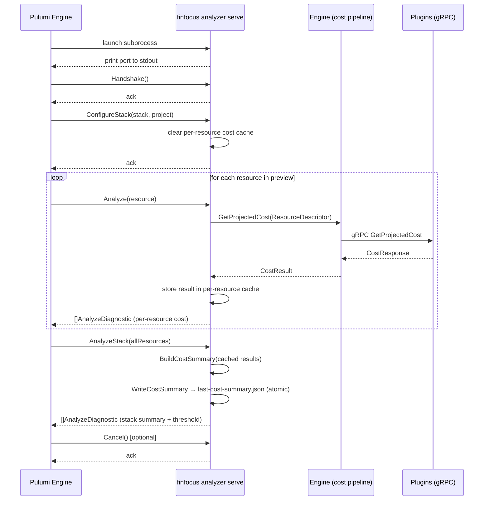

FinFocus integrates with the Pulumi engine via the Pulumi Analyzer gRPC protocol,
enabling zero-click cost estimation during `pulumi preview` and `pulumi up`. The
analyzer intercepts resource definitions in real time, calculates projected costs
through the normal plugin pipeline, and returns advisory diagnostics that Pulumi
displays alongside its diff output.

## Overview

The analyzer runs as a gRPC server that Pulumi launches as a subprocess. Pulumi
sends individual resource definitions as they are evaluated, then sends the complete
stack state once evaluation finishes. FinFocus returns cost diagnostics at both
levels. Enforcement is always ADVISORY: diagnostics are informational and never
block a deployment.

The implementation lives in `internal/analyzer/` and is exposed through the
`finfocus analyzer serve` CLI command (`internal/cli/analyzer_serve.go`).

## Protocol

FinFocus implements the `pulumirpc.AnalyzerServer` interface from the Pulumi SDK
(`github.com/pulumi/pulumi/sdk/v3/proto/go`). The server registers the following
RPCs.

| RPC | Purpose |
|-----|---------|
| `Handshake` | Completes the Pulumi analyzer handshake |
| `ConfigureStack` | Receives stack and project context; clears per-resource cost cache |
| `Analyze` | Receives a single resource; calculates and caches its projected cost |
| `AnalyzeStack` | Receives all resources; aggregates cached costs and emits summary diagnostics |
| `GetAnalyzerInfo` | Returns analyzer identity and active policy list |
| `GetPluginInfo` | Returns plugin version metadata |
| `Cancel` | Accepts a cancellation request (no-op; Pulumi always continues) |

Note: `Analyze` is the per-resource RPC. `AnalyzeStack` fires once at the end of
evaluation with the complete stack. Both are required by the protocol.

## Port Handshake

The Pulumi Analyzer protocol requires a specific startup sequence.

1. `finfocus analyzer serve` binds a gRPC listener on a random TCP port.
2. It prints **only** the port number to stdout, for example `52341`.
3. All log output goes to stderr exclusively.
4. Pulumi reads the port from stdout and connects.

This constraint means the analyzer command must not write anything else to stdout
before or after printing the port, including log lines.

## Interaction Sequence



## Key Components

### Server

`Server` in `internal/analyzer/` implements `pulumirpc.AnalyzerServer`. It holds
a reference to the FinFocus engine, a zerolog logger, and an in-memory map used
to accumulate per-resource cost results between `Analyze` calls and the final
`AnalyzeStack` call.

### Resource Mapping

`MapResource(res *pulumirpc.AnalyzerResource) engine.ResourceDescriptor` converts
a Pulumi resource representation into the internal format the engine accepts.
`MapResources` applies the same transformation to a slice. The mapping extracts:

- `Provider` from the Pulumi type token prefix (e.g., `aws` from `aws:ec2/instance:Instance`)
- `ResourceType` as the full Pulumi type token
- `SKU` from resource inputs (`instanceType`, `type`, etc.)
- `Region` from resource inputs (`availabilityZone`, `region`)

### Diagnostic Constructors

| Function | Output |
|----------|--------|
| `CostToDiagnostic(result)` | Per-resource `AnalyzeDiagnostic` with projected monthly cost |
| `StackSummaryDiagnostic(summary)` | Aggregate stack-level cost summary diagnostic |
| `WarningDiagnostic(message)` | MEDIUM-severity warning for error conditions |

All diagnostics carry `EnforcementLevel = ADVISORY`, which means Pulumi displays
them but does not fail the operation.

### Cost Aggregation

`BuildCostSummary(results []CostResult) CostSummary` aggregates the per-resource
results accumulated during `Analyze` calls. It filters out failed results, detects
mixed currencies, and produces a total. The summary is used by both
`StackSummaryDiagnostic` and the threshold check.

`WriteCostSummary(path string, summary CostSummary) error` serializes the summary
to `last-cost-summary.json` using an atomic write pattern (write to a temp file,
then rename) to prevent partial reads.

### Per-Resource Cache Lifecycle

The analyzer maintains an in-memory map of resource URN to `CostResult`.

- `ConfigureStack` clears the map, ensuring a fresh accumulation for each run.
- `Analyze` populates the map after calling the engine.
- `AnalyzeStack` reads the map, aggregates, and clears it.

This avoids re-querying plugins during `AnalyzeStack` for resources already priced
during `Analyze`.

## Cost Threshold Enforcement (v0.3.0)

When `config.Analyzer.MaxMonthlyCost` is greater than zero, `AnalyzeStack` emits
an additional threshold diagnostic after the stack summary.

| Condition | Severity | Meaning |
|-----------|----------|---------|
| Total cost <= threshold | MEDIUM | Stack is within the configured budget |
| Total cost > threshold | HIGH | Stack exceeds the configured budget |

Both severities use `EnforcementLevel = ADVISORY`. The threshold diagnostic is
skipped when:

- The result set contains mixed currencies.
- All resources failed cost calculation (no valid total is available).

The threshold is configured via `config.yaml`:

```yaml
analyzer:
  max_monthly_cost: 500.00
```

Or via environment variable:

```bash
export FINFOCUS_MAX_MONTHLY_COST=500.00
```

## Policy List

`GetAnalyzerInfo` returns the analyzer identity and its active policies. The policy
list varies based on configuration.

| Policy Name | Always Active | Condition |
|-------------|---------------|-----------|
| `cost-estimate` | Yes | Always returned |
| `stack-cost-summary` | Yes | Always returned |
| `cost-threshold` | No | Only when `MaxMonthlyCost > 0` |

## Graceful Shutdown

The server registers signal handlers for `SIGINT` and `SIGTERM`. On receipt, it
calls `grpcServer.GracefulStop()`, which drains in-flight RPCs before exiting.
Pulumi treats a lost analyzer connection as non-fatal: the preview completes
without cost annotations.

## CLI Usage

```bash
# Start the analyzer server (Pulumi invokes this automatically)
finfocus analyzer serve

# Enable debug logging to stderr
finfocus analyzer serve --debug
```

Configure Pulumi to use the analyzer in `Pulumi.yaml`:

```yaml
analyzers:
  - name: finfocus
```

Pulumi launches `finfocus analyzer serve` as a subprocess, reads the port from
stdout, and connects over gRPC for the duration of the preview or update.

## Logging

All log output uses zerolog at the component level `"analyzer"`. Logging goes
exclusively to stderr. The port number printed to stdout must not be prefixed or
suffixed with any other text.

## Related Documentation

- [System Overview](system-overview.md) - High-level architecture
- [Cost Calculation](cost-calculation.md) - Engine calculation details
- [Plugin Protocol](plugin-protocol.md) - Plugin gRPC protocol
- [CLI Reference](../reference/cli-commands.md) - All CLI commands and flags
