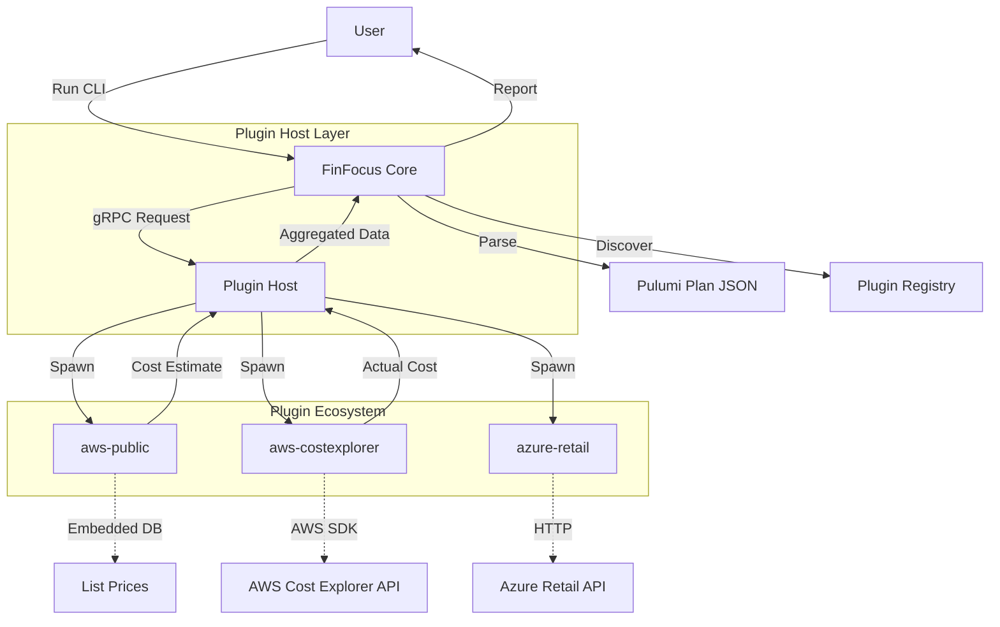

FinFocus relies on a robust plugin ecosystem to separate the core orchestration logic from the provider-specific cost
retrieval implementations. This architecture ensures the core remains lightweight and provider-agnostic.

## System Overview

The system consists of three main components:

1. **Core Engine**: The CLI tool that parses Pulumi infrastructure plans (`pulumi preview --json`) and orchestrates cost
   retrieval.
2. **Plugin Host**: A gRPC server management layer that launches plugins as subprocesses and manages their lifecycle.
3. **Plugins**: Independent executables that implement the [FinFocus Spec](https://github.com/rshade/finfocus-spec)
   protocol to return pricing or usage data.

## Component Roles

### Core

- **Responsibility**: Plan parsing, plugin discovery, lifecycle management, cost aggregation, and reporting.
- **Data Source**: Pulumi JSON output.

### Plugin Host

- **Responsibility**: Multiplexing gRPC calls, health checking, and version negotiation.
- **Protocol**: Protocol Buffers (gRPC).

### Plugins

- **Responsibility**: Mapping cloud resources (e.g., `aws:ec2/instance`) to cost data.
- **Types**:
  - **Fallback/Public**: Uses embedded or public pricing APIs (list prices). No auth required.
  - **Production/Live**: Uses cloud provider billing APIs (Cost Explorer, Billing Conductor). Requires credentials.

## Data Flow Architecture

## Plugin Relationships

### Public vs. Production Plugins

For AWS, FinFocus offers two distinct plugins that serve different stages of the lifecycle:

1. **`aws-public` (The Fallback)**
   - **Purpose**: Pre-deployment estimates (Projected Costs).
   - **Data Source**: Embedded pricing database (offline capable).
   - **Auth**: None required.
   - **Accuracy**: List prices (MSRP), no discounts.

2. **`aws-costexplorer` (The Production Source)**
   - **Purpose**: Post-deployment tracking (Actual Costs).
   - **Data Source**: AWS Cost Explorer API.
   - **Auth**: AWS Credentials required.
   - **Accuracy**: Real billing data, including Reserved Instances (RIs), Savings Plans, and Enterprise Discount Program
     (EDP) rates.

The Core engine automatically routes requests: it uses `aws-public` when no credentials are provided or for projected
costs, and `aws-costexplorer` when configured for actual historical analysis.
