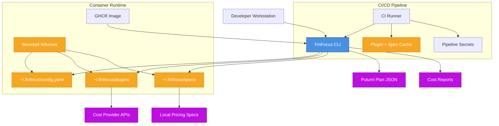

This diagram summarizes how FinFocus is deployed across workstations, CI/CD, and containers.

## How to Read the Diagram

- **CLI** executes cost analysis regardless of environment.
- **Config, plugins, and specs** live in the same directories whether local,
  cached in CI, or mounted into containers.
- **Pulumi plan JSON** remains the input to projected cost analysis.
- **Cost provider APIs** are accessed through plugins when configured.

## Related Guides

- [Deployment Overview](deployment.html)
- [Configuration Guide](configuration.html)
- [Docker Deployment](docker.html)
