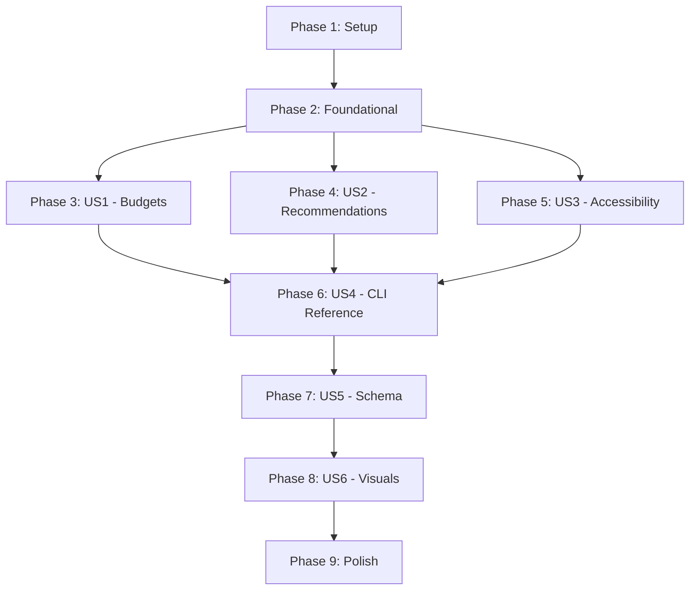

# Implementation Tasks: TUI Documentation Updates

## Phase 1: Setup
- [x] T001 Create documentation project structure and directories
- [x] T002 Initialize visual examples directory in docs/assets/screenshots/
- [x] T003 Create foundational JSON schema for config.yaml in docs/schemas/config-schema.json

## Phase 2: Foundational
- [x] T004 Update docs/TABLE-OF-CONTENTS.md with placeholders for new guides
- [x] T030 Verify search configuration or optimize navigation to satisfy SC-002
- [x] T005 Update root README.md with feature overview and documentation links

## Phase 3: [US1] Budget Configuration (Priority: P1)
**Goal**: Enable users to discover, configure, and leverage budget features effectively.
**Independent Test**: User can follow the Budget Configuration Guide and successfully set up a budget with alerts that trigger in their environment.

- [x] T006 [US1] Create Budget Configuration Guide in docs/guides/budgets.md
- [x] T007 [P] [US1] Create single threshold budget example in docs/examples/config-budgets/single-threshold.yaml
- [x] T008 [P] [US1] Create multiple thresholds budget example in docs/examples/config-budgets/multiple-thresholds.yaml
- [x] T009 [P] [US1] Create CI/CD integration budget example in docs/examples/config-budgets/cicd-integration.yaml
- [x] T010 [P] [US1] Create webhook notifications budget example in docs/examples/config-budgets/webhook-notifications.yaml
- [x] T011 [P] [US1] Create provider-specific budget example in docs/examples/config-budgets/provider-specific.yaml
- [x] T012 [US1] Update docs/reference/config-reference.md with complete budget configuration section

## Phase 4: [US2] Recommendations Feature (Priority: P1)
**Goal**: Enable users to explore and filter cost optimization recommendations from cloud providers.
**Independent Test**: User can follow the Recommendations Guide to run the command, navigate the interactive TUI, and apply filters.

- [x] T013 [US2] Create Recommendations Guide in docs/guides/recommendations.md
- [x] T014 [US2] Update CLI Reference in docs/reference/cli-commands.md with "cost recommendations" command

## Phase 5: [US3] Accessibility Configuration (Priority: P2)
**Goal**: Enable users to configure FinFocus for accessibility and constrained environments.
**Independent Test**: User can follow accessibility documentation to disable colors, enable high-contrast mode, or use plain text output.

- [x] T015 [US3] Create Accessibility Features Guide in docs/guides/accessibility.md

## Phase 6: [US4] CLI Reference Lookup (Priority: P2)
**Goal**: Provide power users with detailed flag and option reference for all commands.
**Independent Test**: User can look up a specific command (e.g., "cost recommendations") and successfully use all documented flags.

- [x] T016 [US4] Document all flags for cost recommendations command in docs/reference/cli-commands.md
- [x] T017 [US4] Update docs/reference/cli-commands.md with common accessibility and formatting flags

## Phase 7: [US5] Configuration Schema Validation (Priority: P3)
**Goal**: Enable IDE autocompletion and validation for configuration files.
**Independent Test**: User adds the schema reference to their config file and verifies IDE autocompletion works in VS Code.

- [x] T018 [US5] Update docs/schemas/config-schema.json with complete budget and accessibility definitions
- [x] T019 [US5] Add schema integration instructions to docs/reference/config-reference.md

## Phase 8: [US6] Visual Examples and Onboarding (Priority: P3)
**Goal**: Provide visual proof of features to improve adoption and onboarding experience.
**Independent Test**: Review documentation and confirm all screenshots/GIFs are present and match actual tool output.

- [x] T020 [P] [US6] Capture budget status TTY mode screenshot in docs/assets/screenshots/budget-tty-mode.png
- [x] T021 [P] [US6] Capture budget status plain mode screenshot in docs/assets/screenshots/budget-plain-mode.png
- [x] T022 [P] [US6] Capture recommendations table screenshot in docs/assets/screenshots/recommendations-table.png
- [x] T023 [P] [US6] Capture recommendations detail view screenshot in docs/assets/screenshots/recommendations-detail.png
- [x] T024 [P] [US6] Capture loading spinner animation in docs/assets/screenshots/loading-spinner.gif
- [x] T025 [P] [US6] Capture error message examples in docs/assets/screenshots/error-messages.png

## Phase 9: Polish & Cross-Cutting Concerns
- [x] T026 Perform final cross-linking audit across all guides and reference documents
- [x] T027 Run `make docs-lint` and fix all markdownlint errors
- [x] T028 Verify all internal and external links using `markdown-link-check`
- [x] T029 Perform manual end-to-end review of documentation against actual CLI behavior

## Dependency Graph

## Parallel Execution Examples

### Within Phase 3 (Budgets)
- T007, T008, T009, T010, T011 (Creating YAML examples can happen in parallel)

### Within Phase 8 (Visuals)
- T020, T021, T022, T023, T024, T025 (Capturing different screenshots can happen in parallel)

## Implementation Strategy

1. **MVP First**: Complete Phase 1 and 2, then prioritize US1 and US2 (P1 stories).
2. **Incremental Delivery**: Each phase produces a complete, usable documentation increment.
3. **Accuracy First**: Test all commands and YAML snippets against the actual CLI before documenting.
4. **Consistency**: Use the templates defined in Phase 1 for all new guides and reference entries.
